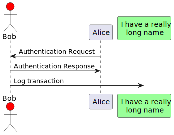

# Tài Liệu Yêu Cầu

## Giới Thiệu
Tóm tắt ngắn gọn về dự án và mục đích của tài liệu.

## Tài Liệu Các Yêu Cầu Người Dùng
- **Mô tả**: Các yêu cầu chính từ góc độ người dùng.
- **Tính năng chính**: Các chức năng quan trọng mà hệ thống cần phải cung cấp.
- **Kịch bản sử dụng**: Các tình huống sử dụng chính của hệ thống.

## Yêu Cầu Kỹ Thuật
- **Yêu cầu hệ thống**: Cấu hình phần cứng và phần mềm.
- **Tương tác với hệ thống khác**: Các hệ thống hoặc dịch vụ bên ngoài mà hệ thống sẽ tương tác.

## Yêu Cầu Chất Lượng
- **Hiệu suất**: Các yêu cầu về tốc độ và hiệu suất.
- **Bảo mật**: Các yêu cầu về bảo mật và quyền truy cập.

## Kế Hoạch Kiểm Thử
- **Chiến lược kiểm thử**: Các loại kiểm thử sẽ được thực hiện.
- **Tiêu chí chấp nhận**: Các tiêu chí mà hệ thống phải đáp ứng để được chấp nhận.

## Thiết kế hệ thống

